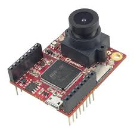

# Lego Brick Sorter Machine

This project is inspired by [Daniel West's project][4] to build a Lego sorter

[Lego Sorter][5]

This YouTube video is a nice explantion of the three steps to build a Lego sorter

#### 1.  [Build a dataset to train the AI][1] using the [Ldraw Library][3] and use [blender][2] to render the image, I have adapted this from J Theiner python script.

#### Render a Single Brick
Control of the blender script as stand-alone:
blender -b -P dataset/blender/render.py -- -i 9.dat --save ./ --images_per_brick 1 --config thumbnail.json

#### Render Brick Set
render images 50 for each id
image size: 224x224x3
brick augmentation:
11,000 official brick colors
rotation: in x direction due to no standardized origin: 0, 90, 180, 270
scaling: normalized one dimension and size variation via zooming factor
[ ] surface texture and reflexion
setting background:
random images from Background.jpg image
camera position: random on the surface on the upper half of a sphere
exposure: random spot on the sphere surface, radius and energy fixed
[ ] varying exposure
Script to render all images: python dataset/generate_dataset.py

Hint for Mac users to access blender: /Applications/Blender/blender.app/Contents/MacOS/blender -b -P ...

#### 2.  Train the AI with Tensorflow using [Kaggle][7] using the cloud GPU to produce the preprocess the dataset & classifier model. 

Once the Lego Bricks have been rendered it is uploaded to Kaggle [7] to build the Tensorflow Dataset which is compatible with Tensorflow.

Them the model can be trainned from the dataset.

#### 3.  Build a image capature and classification process using the classifier model using the OpenMV 

System has been build on Raspberrypi Model B but is very slow and the AI has to be executed remotely.

Using the OpenMV it is hoped that the AI deployed onto the local machine.
 

## Requirements / Installation

##### Blender 2.90 + ImportLDraw
##### Kaggle Account
##### OpenMV/RaspberryPI

## Thing to Do

##### Deploy Tensorflow model to OpenMV/RaspberryPi
##### Build dataset with 100,000 images of brick in Blender

[1]: https://github.com/Gadgeteering/LegoBrickClassification/blob/master/README.md
[2]: https://github.com/TobyLobster/ImportLDraw
[3]: http://www.ldraw.org/
[4]: https://youtu.be/-UGl0ZOCgwQ
[5]: https://towardsdatascience.com/how-i-created-over-100-000-labeled-lego-training-images-ec74191bb4ef
[6]: https://colab.research.google.com/
[7]: https://www.kaggle.com/gadgeteering/build-lego-dataset

